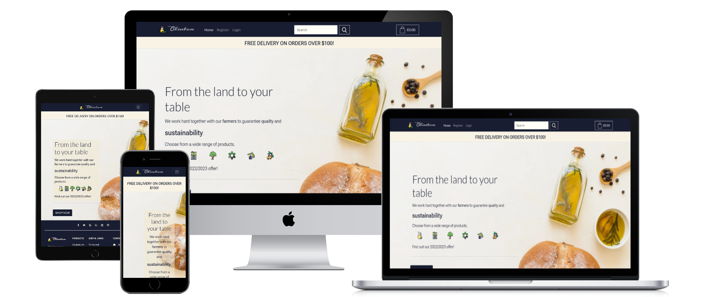
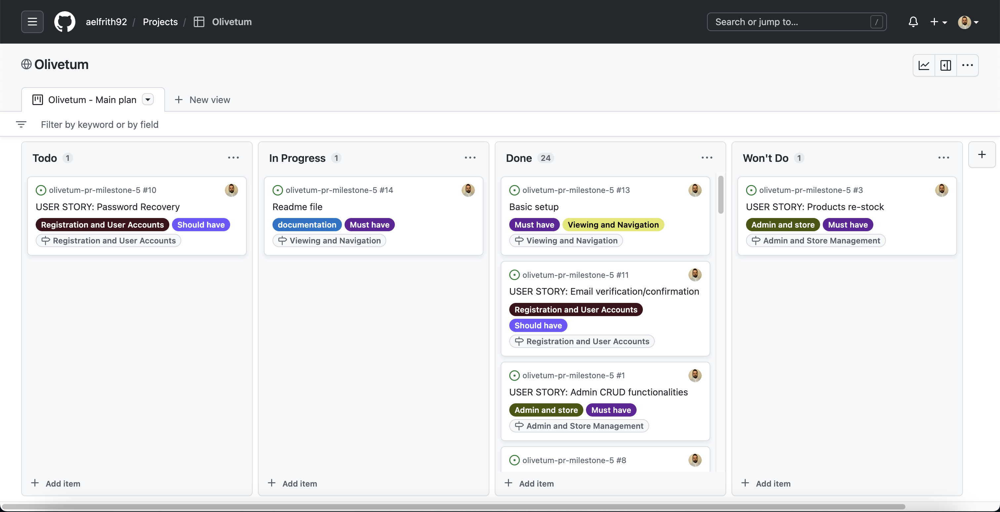
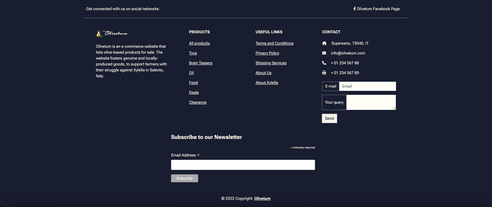
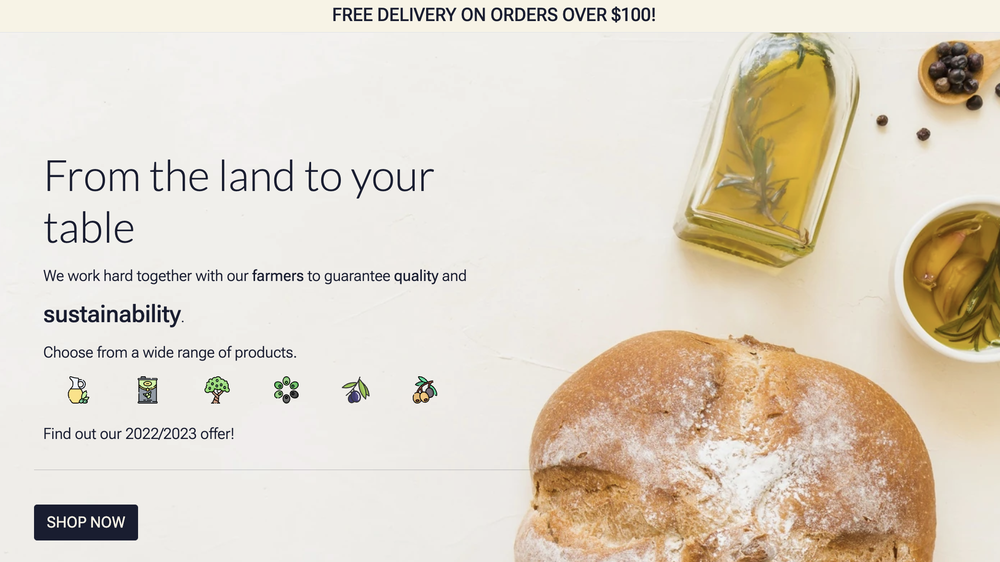
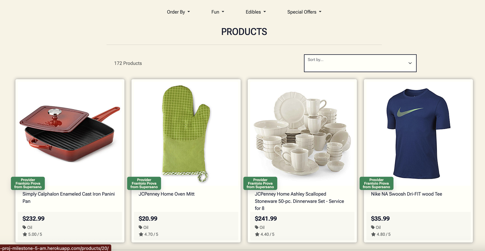
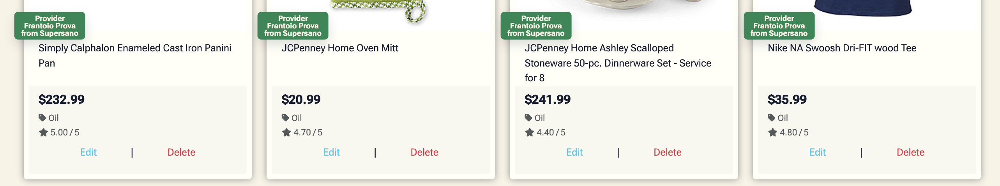
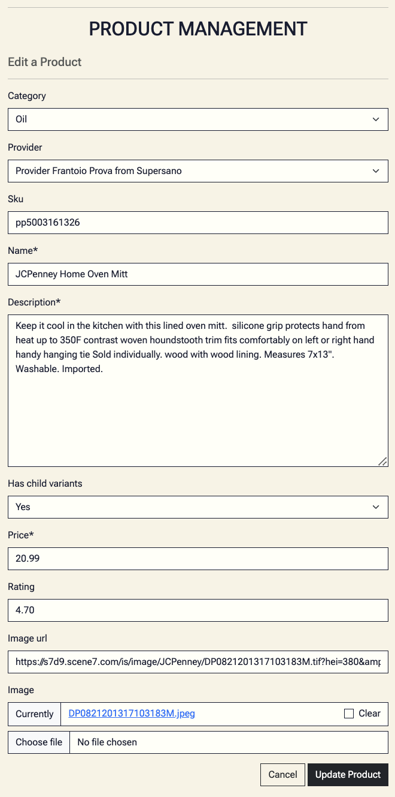
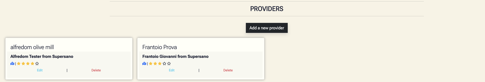
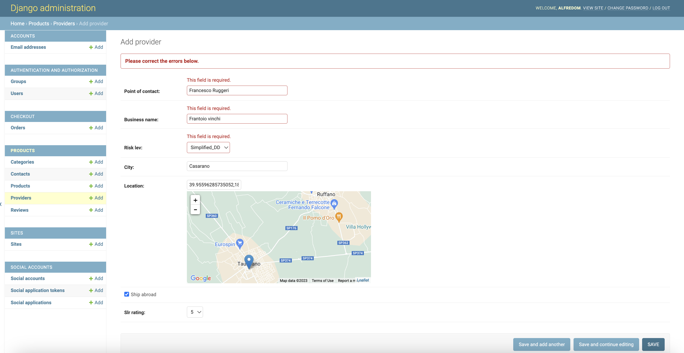

[```Disclaimer: This project contains graphic material that requires attribution. See the section relating to the footer for further details.```]

# Olivetum

Olivetum is an e-commerce website that lists olive-based products for sale. The website fosters genuine and
locally-produced goods, to support farmers with their struggle against Xylella in Salento, Italy. See [this
article](https://www.olivami.com/en/blog/curiosities-about-olive-trees/xylella-an-unprecedented-battle/) for further
information about the context. This project collects all farmers' produce and pays them back, once their products are
successfully sold for profit. The products may range from olive oil, tapenade, or pitted kalamata, depending on the
 availability.



## Table of Contents
* [User Experience Design (UX)](#User-Experience-Design)
    * [The Strategy Plane](#The-Strategy-Plane)
        * [Site Goals](#Site-Goals)
        * [Agile Planning](#Agile-Planning)
          * [User Stories](#User-Stories)
    * [The Scope Plane](#The-Scope-Plan)
    * [The Structure Plane](#The-Structure-Plan)

# User Experience Design

## The-Strategy-Plane

### Site-Goals

The website empowers local farmers with online presence, to let them reach a broader target, that ranges from private
customers to businesses, such as restaurants. In other words, the selling activity is meant for both B2C and B2B models.
Initially, this project gives complete authority to the owners of the website, that will mediate between providers (the
farmers) and end-customers. On a later stage, the website becomes a platform that will offer sellers' onboarding, to let
each selling account conduct their selling strategy. This will be eventually possible with Stripe Connect and related
services.

Roles on the website will be administrators, staff, sellers/providers, and end-customers/users. Each account type behaves differently
on the platform. The scope of this project will grant these roles all the basic and required functions expected for the
selling activity. For example, sellers/providers' profiles will store basic information about themselves, to show the end-user the
source of the products being purchased; there is no need to collect KYC data in this phase, as the staff will take on
this responsibility at the beginning.

### Agile Planning

This project intends to use agile methodologies, by delivering small features in incremental sprints. The time this
document was drafted, 4 sprints were mainly projected.

All issues were assigned to epics, prioritized under the labels Must have, Should have, Could have. They were assigned
to sprints and stories according to their complexity (being self-explanatory). This allowed the main requirements to be
completed first, while secondary features could be added whether time could be allocated to them or not.

The Kanban board was created using github projects and can be found [here](https://github.com/users/aelfrith92/projects/4). It can be viewed to see
more information on the project cards. Some stories have a set of acceptance criteria in order to define the
functionality that marks that story as complete. Some other stories do not have acceptance criteria, as they were
considered self-explanatory.



#### User Stories

The following user stories were completed over time. Basic setup stories - such as development-related ones - have been
omitted, to prioritize those strictly pertaining the end-user experience.

The categories of users described below are:
- "Site User" - meant as a non-authenticated user or user of the website in the broadest and most general sense.
- "Admin" - meant as an authenticated user with admin privileges.
- "Shopper" - meant as an authenticated user whose purpose is to place orders and review products.

**Customer's statement**

As the shop owners, we give local farmers the opportunity to reach a broader target, via online shopping. Shoppers will
be able to interact with the website, to manage their orders and purchasing process. The staff/owners can help in
specific scenarios, to guarantee the best CX.

**Epics**

The project can be divided into 5 Epics.

**Admin and store management**

As a site admin I can manipulate (add/edit/delete) products, so that I can handle the available listings on the website.

As a site admin I can manipulate (add/edit/delete) providers, so that I can handle those registered on the website.

As a site admin I can moderate (approve/hide/unhide) product reviews, so that I can prevent bad actors from leaving malicious
or misleading information.

**Viewing and Navigation**

As a shopper, I can view the list of available products, so that I can select some to purchase.

As a shopper, I can view the individual product details, so that I can see the price, description, product rating,
product image, and available options such as litres.

As a shopper, I can quickly identitfy deals, clearance items and special offers, so that I can take advantage of special
savings on products.

As a shopper, I can easily view the total of my purchases at any time, so that I can avoid spending too much.

**Registration and User Accounts**

As a site user, I can easily register for an account, so that I have a personal account and be able to view my profile.

As a site user, I can easily log in or log out, so that I can access my personal account information.

As a site user, I can easily recover my password in case I forget it, so that I recover access to my account.

As a site user, I can receive an email confirmation after registering, so that I verify that my account registration was
successful.

As a site user, I can have a personalised user profile, so that I view my personal order history and save my payment
information.

**Sorting and Searching**

As a shopper, I can sort the list of available products, so that I can easily identify the best-rated, best-priced, and
categorically-sorted products.

As a shopper, I can sort sort a specific category of products, so that I can easily identify the best-rated, best-priced
product in a specific category, or sort the products in that category by name.

As a shopper, I can sort multiple categories of products simultaneously, so that I can find the best-rated or
best-priced products across broad categories, such as "food" and "homeware".

As a shopper, I can search for a product by name or description, so that I can find a specific product I would like to
purchase.

As a shopper, I can search for a product by name or description, so that I can find a specific product I would like to
purchase.

As a shopper, I can easily see what I have searched for and the number of results, so that I can quickly decide whether
the product I want is available.

**Purchasing and Checkout**

As a shopper, I can easily select the size and the quantity of a product when purchasing it, so that I can ensure I do
not accidentally select the wrong product, quantity, or size.

As a shopper, I can view items in my bag to be purchased, so that I can identify the total cost of my purchase and all
items I will receive.

As a shopper, I can adjust the quantity of individual items in my bag, so that I can easily make changes to my purchase
before checkout.

As a shopper, I can easily enter my payment information, so that I can check out quickly and with no hassles.

As a shopper, I can feel my personal and payment information are safe and secure, so that I confidently provide the
needed information to make a purchase.

As a shopper, I can view an order confirmation after checkout, do that I can verify that I have not made any mistakes.

As a shopper, I can receive an email confirmation after checking out, so that I can keep the confirmation of what I have
purchased for my records.

As a shopper, I can leave product reviews, so that I can leave my personal opinion about the purchase experience.

**Documentation**

Tasks:

* Complete readme documentation
* Complete testing documentation write up

## The-Scope-Plan

* Responsive Design - Site should be fully functional on all devices from 320px up
* Hamburger menu for mobile devices
* Ability to perform CRUD functionality on products - admin
* Ability to perform CRUD functionality on providers - admin
* Restricted role-based features
* Home page with grid of products
* Review of orders for shoppers
* Review of payment details for shoppers
* Contact form for users
* Newsletter subscription for users

## The-Structure-Plan

### Features

``CUSTOMER'S STATEMENT - As the shop owners, we give local farmers the opportunity to reach a broader target, via online shopping. Shoppers will be able to interact with the website, to manage their orders and purchasing process. The staff/owners can help in specific scenarios, to guarantee the best CX.`` 

Within this statement, there are a series of taken-for-granted features that should cover essential home page components, such as the navigation menu at the top.

Implementation:

**Navigation Menu**


 The Navigation contains links for 
 - Home, 
 - Allauth options, 
 - Management (product creation and provider CRUD functionalities),
 - Personal profile,
 - Products searchbar,
 - Bag and grand total overview

The following navigation items are available on all pages:
  * Home -> Visible to all
  * Login -> Visible to logged out users
  * Register -> Visible to logged out users
  * Logout -> Visible to logged in users
  * Management > Add a product -> Visible to logged in admins
  * Management > All providers -> Visible to logged in admins
  * My Profile > -> Visible to logged in users
  * Products searchbar -> Visible to all
  * Bag and grand total overview -> Visible to all

The navigation menu is displayed on all pages and drops down into a hamburger menu on smaller devices. This will allow users to view the site from any device and not take up too much space on mobile devices. The navigation menu is part of the base template.

**Footer**



The Footer contains the following sections:
 - Short description and purpose of the website, 
 - Producst, followed by the related categories,
 - Useful links, such as Privacy Policy and About Xylella, while the rest is listed for demo purposes only,
 - Contact, with fictitious information about the business, a functioning contact form,
 - Newsletter form,
 - Social media, where only a fictitious FB page anchor is implemented, for demo purposes.

All items available on all pages.

The footer is part of the base template.

__``Admin and store management``__

``As a site admin I can manipulate (add/edit/delete) products, so that I can handle the available listings on the website.``

On the index or initial page, the user is presented with a welcoming message, together with a symbolic background that depicts olive oil and food at large. The message clearly states the scope of the offered products (from local farmers, sustainable). A banner fixed at the top warns about last offers - available on all pages, via the base template. The user can get to the list of prodcts by clicking on the button "SHOP NOW" button.



A list of paginated-by-24 products is available via the 'products' view.



Update and Delete functionalities are visible, if logged as an admin.



The create functionality is available via the navigation menu > Management > Add a product. Create and Update functionalities lead to the respective views, while the delete function is executed as soon as the link is clicked. The UIs for create and update functions are the same, but the update view pre-populates the fields.



``As a site admin I can manipulate (add/edit/delete) providers, so that I can handle those registered on the website.``

Same logic is applied to the providers, via dedicated views. All providers can be seen via the navigation menu > All providers.



Within the same page, create, update, and delete functionalities are easily accessible via their dedicated views. If providers are handled via the admin view, a google map widget is successfully rendered within the form.



Providers info are shown on each related product with a label. See the pictures above.

``As a site admin I can moderate (approve/hide/unhide) product reviews, so that I can prevent bad actors from leaving malicious
or misleading information.``


#### Colour-palette
The main colour palette can be found at https://colorhunt.co/palette/181d31678983e6ddc4f0e9d2