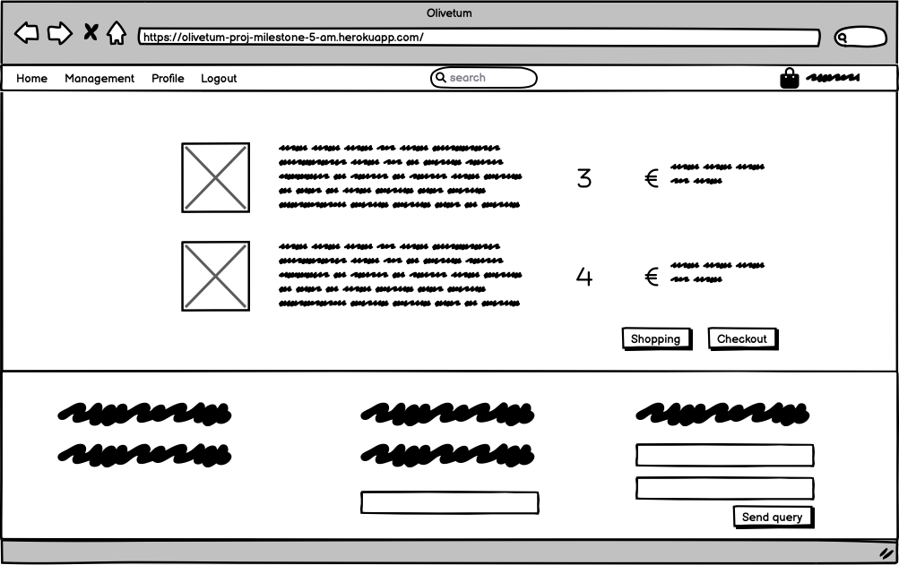

[```Disclaimer: This project contains graphic material that requires attribution. See the section relating to the Surface plan - Imagery.```]

# Olivetum

Olivetum is an e-commerce website that lists olive-based products for sale. The website fosters genuine and
locally-produced goods, to support farmers with their struggle against Xylella in Salento, Italy. See [this
article](https://www.olivami.com/en/blog/curiosities-about-olive-trees/xylella-an-unprecedented-battle/) for further
information about the context. This project collects all farmers' produce and pays them back, once their products are
successfully sold for profit. The products may range from olive oil, tapenade, or pitted kalamata, depending on the
 availability.


## Table of Contents
* [User Experience Design (UX)](#User-Experience-Design)
    * [The Strategy Plane](#The-Strategy-Plane)
        * [Site Goals](#Site-Goals)
        * [Agile Planning](#Agile-Planning)
          * [User Stories](#User-Stories)
    * [The Scope Plane](#The-Scope-Plan)
    * [The Structure Plane](#The-Structure-Plan)
      * [Features](#Features)
      * [Future Features](#Features-Left-to-Implement)
    * [The Skeleton Plane](#The-Skeleton-Plane)
        * [Wireframes](#Wireframes)
        * [Database Design](#Database-Design)
        * [Security](#Security)
        * [SEO Considerations](#SEO-Considerations)
    * [The Surface Plane](#The-Surface-Plane)
        * [Design](#Design)
            * [Colour Scheme](#Colour-Scheme)
            * [Typography](#Typography)
            * [Imagery](#Imagery)
* [Technologies](#Technologies)
  * [Resources Used](#Resources-Used)
* [Social Media](#Social-Media)
* [Testing](#Testing)
  ** [Functional Testing](Functional-Testing)
  ** [Negative Testing](Negative-Testing)
* [Deployment](#Deployment)
    * [Version Control](#Version-Control)
    * [Heroku Deployment](#Heroku-Deployment)
    * [Run Locally](#Run-Locally)
    * [Fork Project](#Fork-Project)
* [Credits](#Credits)

# User-Experience-Design

## The-Strategy-Plane

### Site-Goals

The website empowers local farmers with online presence, to let them reach a broader target, that ranges from private
customers to businesses, such as restaurants. In other words, the selling activity is meant for both B2C and B2B models.
Initially, this project gives complete authority to the owners of the website, that will mediate between providers (the
farmers) and end-customers. On a later stage, the website becomes a platform that will offer sellers' onboarding, to let
each selling account conduct their selling strategy. This will be eventually possible with Stripe Connect and related
services.

Roles on the website will be administrators, staff, sellers/providers, and end-customers/users. Each account type behaves differently
on the platform. The scope of this project will grant these roles all the basic and required functions expected for the
selling activity. For example, sellers/providers' profiles will store basic information about themselves, to show the end-user the
source of the products being purchased; there is no need to collect KYC data in this phase, as the staff will take on
this responsibility at the beginning.

### Agile Planning

This project intends to use agile methodologies, by delivering small features in incremental sprints. The time this
document was drafted, 4 sprints were mainly projected.

All issues were assigned to epics, prioritized under the labels Must have, Should have, Could have. They were assigned
to sprints and stories according to their complexity (being self-explanatory). This allowed the main requirements to be
completed first, while secondary features could be added whether time could be allocated to them or not.

The Kanban board was created using github projects and can be found [here](https://github.com/users/aelfrith92/projects/4). It can be viewed to see
more information on the project cards. Some stories have a set of acceptance criteria in order to define the
functionality that marks that story as complete. Some other stories do not have acceptance criteria, as they were
considered self-explanatory.


#### User Stories

The following user stories were completed over time. Basic setup stories - such as development-related ones - have been
omitted, to prioritize those strictly pertaining the end-user experience.

The categories of users described below are:
- "Site User" - meant as a non-authenticated user or user of the website in the broadest and most general sense.
- "Admin" - meant as an authenticated user with admin privileges.
- "Shopper" - meant as an authenticated user whose purpose is to place orders and review products.

**Customer's statement**

As the shop owners, we give local farmers the opportunity to reach a broader target, via online shopping. Shoppers will
be able to interact with the website, to manage their orders and purchasing process. The staff/owners can help in
specific scenarios, to guarantee the best CX.

**Epics**

The project can be divided into 5 Epics.

**Admin and store management**

As a site admin I can manipulate (add/edit/delete) products, so that I can handle the available listings on the website.

As a site admin I can manipulate (add/edit/delete) providers, so that I can handle those registered on the website.

As a site admin I can moderate (approve/hide/unhide) product reviews, so that I can prevent bad actors from leaving malicious
or misleading information.

**Viewing and Navigation**

As a shopper, I can view the list of available products, so that I can select some to purchase.

As a shopper, I can view the individual product details, so that I can see the price, description, product rating,
product image, and available options such as litres.

As a shopper, I can quickly identitfy deals, clearance items and special offers, so that I can take advantage of special
savings on products.

As a shopper, I can easily view the total of my purchases at any time, so that I can avoid spending too much.

**Registration and User Accounts**

As a site user, I can easily register for an account, so that I have a personal account and be able to view my profile.

As a site user, I can easily log in or log out, so that I can access my personal account information.

As a site user, I can easily recover my password in case I forget it, so that I recover access to my account.

As a site user, I can receive an email confirmation after registering, so that I verify that my account registration was
successful.

As a site user, I can have a personalised user profile, so that I view my personal order history and save my payment
information.

**Sorting and Searching**

As a shopper, I can sort the list of available products, so that I can easily identify the best-rated, best-priced, and
categorically-sorted products.

As a shopper, I can sort sort a specific category of products, so that I can easily identify the best-rated, best-priced
product in a specific category, or sort the products in that category by name.

As a shopper, I can sort multiple categories of products simultaneously, so that I can find the best-rated or
best-priced products across broad categories, such as "food" and "homeware".

As a shopper, I can search for a product by name or description, so that I can find a specific product I would like to
purchase.

As a shopper, I can search for a product by name or description, so that I can find a specific product I would like to
purchase.

As a shopper, I can easily see what I have searched for and the number of results, so that I can quickly decide whether
the product I want is available.

**Purchasing and Checkout**

As a shopper, I can easily select the size and the quantity of a product when purchasing it, so that I can ensure I do
not accidentally select the wrong product, quantity, or size.

As a shopper, I can view items in my bag to be purchased, so that I can identify the total cost of my purchase and all
items I will receive.

As a shopper, I can adjust the quantity of individual items in my bag, so that I can easily make changes to my purchase
before checkout.

As a shopper, I can easily enter my payment information, so that I can check out quickly and with no hassles.

As a shopper, I can feel my personal and payment information are safe and secure, so that I confidently provide the
needed information to make a purchase.

As a shopper, I can view an order confirmation after checkout, do that I can verify that I have not made any mistakes.

As a shopper, I can receive an email confirmation after checking out, so that I can keep the confirmation of what I have
purchased for my records.

As a shopper, I can leave product reviews, so that I can leave my personal opinion about the purchase experience.

**Documentation**

Tasks:

* Complete readme documentation
* Complete testing documentation write up

## The-Scope-Plane

* Responsive Design - Site should be fully functional on all devices from 320px up
* Hamburger menu for mobile devices
* Ability to perform CRUD functionality on products - admin
* Ability to perform CRUD functionality on providers - admin
* Restricted role-based features
* Home page with grid of products
* Review of orders for shoppers
* Review of payment details for shoppers
* Contact form for users
* Newsletter subscription for users

## The-Structure-Plane

### Features

``CUSTOMER'S STATEMENT - As the shop owners, we give local farmers the opportunity to reach a broader target, via online shopping. Shoppers will be able to interact with the website, to manage their orders and purchasing process. The staff/owners can help in specific scenarios, to guarantee the best CX.`` 

Within this statement, there are a series of taken-for-granted features that should cover essential home page components, such as the navigation menu at the top.

Implementation:

**Navigation Menu**


 The Navigation contains links for 
 - Home, 
 - Allauth options, 
 - Management (product creation and provider CRUD functionalities),
 - Personal profile,
 - Products searchbar,
 - Bag and grand total overview

The following navigation items are available on all pages:
  * Home -> Visible to all
  * Login -> Visible to logged out users
  * Register -> Visible to logged out users
  * Logout -> Visible to logged in users
  * Management > Add a product -> Visible to logged in admins
  * Management > All providers -> Visible to logged in admins
  * My Profile > -> Visible to logged in users
  * Products searchbar -> Visible to all
  * Bag and grand total overview -> Visible to all

The navigation menu is displayed on all pages and drops down into a hamburger menu on smaller devices. This will allow users to view the site from any device and not take up too much space on mobile devices. The navigation menu is part of the base template.

**Footer**


The Footer contains the following sections:
 - Short description and purpose of the website, 
 - Producst, followed by the related categories,
 - Useful links, such as Privacy Policy and About Xylella, while the rest is listed for demo purposes only,
 - Contact, with fictitious information about the business, a functioning contact form,
 - Newsletter form,
 - Social media, where only a fictitious FB page anchor is implemented, for demo purposes.

All items available on all pages.

The footer is part of the base template.

__``Admin and store management``__

``As a site admin I can manipulate (add/edit/delete) products, so that I can handle the available listings on the website.``

On the index or initial page, the user is presented with a welcoming message, together with a symbolic background that depicts olive oil and food at large. The message clearly states the scope of the offered products (from local farmers, sustainable). A banner fixed at the top warns about last offers - available on all pages, via the base template. The user can get to the list of prodcts by clicking on the button "SHOP NOW" button.


A list of paginated-by-24 products is available via the 'products' view.


Update and Delete functionalities are visible, if logged as an admin.


The create functionality is available via the navigation menu > Management > Add a product. Create and Update functionalities lead to the respective views, while the delete function is executed as soon as the link is clicked. The UIs for create and update functions are the same, but the update view pre-populates the fields.


``As a site admin I can manipulate (add/edit/delete) providers, so that I can handle those registered on the website.``

Same logic is applied to the providers, via dedicated views. All providers can be seen via the navigation menu > All providers.


Within the same page, create, update, and delete functionalities are easily accessible via their dedicated views. If providers are handled via the admin view, a google map widget is successfully rendered within the form.


Providers info are shown on each related product with a label. See the pictures above.

``As a site admin I can moderate (approve/hide/unhide) product reviews, so that I can prevent bad actors from leaving malicious
or misleading information.``


In the product detail page-

- Admin users can Hide/Unhide reviews. Hidden reviews are highlighted with dashed borders, visible to admins only.

- Users can read the reviews.

- Auth users can leave or update a review, encompassing a rating 1 to 5, the title, the body.

- Authors can delete their respective reviews. Authors will also see their reviews highlighted with 1px borders and the "My review" badge under the rating.

- Users leaving reviews on products purchased in the past will have the "Verified Purchase" badge on their review.

``As a shopper, I can view the list of available products, so that I can select some to purchase.``


Products are paginated by 24 each page to improve the general website performance.

``As a shopper, I can view the individual product details, so that I can see the price, description, product rating,
product image, and available options such as litres.``


The product details page let the user have a general overview of the product: Title, unit price, category, rating, decription, image, sub-variants (if any), quantity, back-to-list and add-to-bag buttons.

``As a shopper, I can quickly identitfy deals, clearance items and special offers, so that I can take advantage of special
savings on products.``


Filters let the user customise the products list view. Parameters like category or sorting asc/desc apply.

``As a shopper, I can easily view the total of my purchases at any time, so that I can avoid spending too much.``


The bag icon top right (or bottom, in case of mobile view) shows the aggregated total.

``As a site user, I can easily register for an account, so that I have a personal account and be able to view my profile.``


The user is invited to sign up, if they want to finalise an order on the e-Commerce.

``As a site user, I can easily log in or log out, so that I can access my personal account information.``


The user needs to enter their credentials to correctly start a session and avail of the several features offered.

``As a site user, I can easily recover my password in case I forget it, so that I recover access to my account.``


``As a site user, I can receive an email confirmation after registering, so that I verify that my account registration was
successful.``


``As a site user, I can have a personalised user profile, so that I view my personal order history and save my payment
information.``


``As a shopper, I can sort the list of available products, so that I can easily identify the best-rated, best-priced, and
categorically-sorted products.``

``As a shopper, I can sort sort a specific category of products, so that I can easily identify the best-rated, best-priced
product in a specific category, or sort the products in that category by name.``

``As a shopper, I can sort multiple categories of products simultaneously, so that I can find the best-rated or
best-priced products across broad categories, such as "food" and "homeware".``

As shown above, users can select several filters, once on the products list page:


``As a shopper, I can search for a product by name or description, so that I can find a specific product I would like to
purchase.``

It is possible to search by name or description via the search box in the navbar:


``As a shopper, I can easily see what I have searched for and the number of results, so that I can quickly decide whether
the product I want is available.``

The number of results and the search query are returned as soon as the page loads:


``As a shopper, I can easily select the size and the quantity of a product when purchasing it, so that I can ensure I do
not accidentally select the wrong product, quantity, or size.``

Users can select the subvariants on products under the "Oil" category:


``As a shopper, I can view items in my bag to be purchased, so that I can identify the total cost of my purchase and all
items I will receive.``

``As a shopper, I can adjust the quantity of individual items in my bag, so that I can easily make changes to my purchase
before checkout.``


``As a shopper, I can easily enter my payment information, so that I can check out quickly and with no hassles.``


``As a shopper, I can feel my personal and payment information are safe and secure, so that I confidently provide the
needed information to make a purchase.``

The payment process, card-saving dynamics, 3D Secure checks etc. are handled by Stripe. Visit [here](https://stripe.com/docs/security) for more.

``As a shopper, I can view an order confirmation after checkout, so that I can verify that I have not made any mistakes.``


``As a shopper, I can receive an email confirmation after checking out, so that I can keep the confirmation of what I have purchased for my records.``


``As a shopper, I can leave product reviews, so that I can leave my personal opinion about the purchase experience.``

See above, admin stories.

Further implemented:

``As a user, I can reach out to the staff of Olivetum, so that I can submit my queries.``

``As a user, I can subscribe to the newsletter, find social media / online presence, and a document about the privacy policy, so that I can find a series of useful links.``

At the bottom-right, users can find an essential contact form, which behaves differently, depending on the authentication:
- auth: the user receives a standard confirmation of query submission.
- non-auth: the user receives an email warning about the necessity to authenticate, should the author of the contact query have requested sensitive information.


The newsletter subscription is available via the form at the bottom, visible in the last screenshot above. The code was generated on mailchimp.

### Features Left To Implement

In the future, some obvious adjustments both in technical and UX terms will be applied. For example:

* The general appearance will be better developed;
* Some external services, such as mailchimp and stripe, return errors in the console that cannot be completely handled at this stage. JS Destroying methods or further troubleshooting will be employed;
* Re-stock logic will be implemented, by editing the models accordingly.

## The Skeleton Plane

### Wireframes

The website was designed with responsiveness in mind, however, wireframing was meant to get a general idea of the first impression, hence, mobile wireframing is not available. There are discrepancies within the menu items depicted, as authenticated sessions change the content of the navbar.

* Home Page


* Products


* Product Details


* Product Details - Review


* Bag



* Checkout


* Order Summary


* Profile Summary


* Sign in


* Sign up


* Password Reset


### Database-Design

The database was designed to allow CRUD functionality to be available to registered users, when signed in. The user model plays a crucial role in handling authentication, provided by Django. Enhanced user permissions were designed based on the user.is_staff and user.is_superuser boolean fields. Further information about this model can be found on [Django](https://docs.djangoproject.com/en/4.1/ref/contrib/auth/).

The Product model includes information about the respective category and provider.

The Review model includes information about the respective product.

The Order model includes information about the respective User Profile.

The OrderLineItem model includes information about the respective product and order.

The UserProfile model includes information about the respective User.

The entity relationship diagram was created using a spreadsheet environment and shows the schemas for each of the models and how they are related.


### Security

Views were secured by using not only the django @login_required decorators before the respective views, but also via ad-hoc if statements checking the user permissions passed through the requests. Any staff restricted functionality, i.e. user edit/delete functionalities for provider or product models were secured using this method.

Environment variables were stored in an env.py for local development. In production, these variables were added to the heroku config vars within the project.

### SEO Considerations

<br>

#### Keyword Research
Research was conducted to discover the appropriate keywords to utilise given the target customer markets and product range to be carried. This research was based on Google's SEO tools which provides details of common search terms users search for and allows you to search these terms by target market. The UK, Ireland and the USA markets were used for example purposes.

<br>


<br>


<br>

[Olive Oil Keyword Research - USA](media/docs/readme_images/SEO-keyword-US.png)

<br>

From this research a refined keyword list was cultivated for use with the short-tail keywords within the head meta tags and for content through out the site. However this only formed a small part of the overall strategy for the sites SEO strategy.

#### Content Strategy
The main foundation for the sites SEO strategy was to provide a platform for the company from which they can provide users with informative and relevant information. Product pages were designed to include more details that the average product page - which enables the company to configure the descriptions in a manner that maximises the SEO value. The blog section of the site enables the company to write informative articles that can answer commonly searched for questions. This will enable the company to increase their authoritativeness on relevant topics that their users are searching for. Three articles were provided with content acquired from other relevant websites. There articles were edited to incorporate the keywords discovered from the earlier research.

## The Surface Plan
### Design

### Colour-Scheme

The main colour palette can be found at https://colorhunt.co/palette/181d31678983e6ddc4f0e9d2


The present project handled style via BS5, overriding CSS style when necessary.

### Typography

The Roboto, Lato fonts were used throughout the website. Source [Google Fonts](https://fonts.google.com/)

### Imagery

Images uploaded on an AWS S3 Bucket and visible on the website were retrieved from [Pixabay](https://pixabay.com/). Attributions are required, hence, the authors will be listed as follows, while a general statement will eventually be included in the footer.
- Pictures retrieved from [author with anchor to the respective pic]:
  - [stevepb](https://pixabay.com/photos/olive-oil-olives-food-oil-natural-968657/)
  - [Couleur](https://pixabay.com/photos/olive-oil-oil-food-carafe-1596417/)
  - [Couleur](https://pixabay.com/photos/olive-oil-oil-olives-carafe-fruits-1596639/)
  - [Anelka](https://pixabay.com/photos/olive-oil-tomatoes-herbs-spices-346997/)
  - [photoAC](https://pixabay.com/photos/olive-oil-pickled-appetizers-snack-2614000/)
  - [Pezibear](https://pixabay.com/photos/oil-olive-oil-bottles-food-meal-1383546/)
  - [Pezibear](https://pixabay.com/photos/oil-olive-oil-bottles-food-meal-1383602/)
  - [manfredrichter](https://pixabay.com/photos/olives-drupes-mediterranean-meal-3191245/)

- Icons retrieved from [official attribution copied from flaticon.com]:
  - <a href="https://www.flaticon.com/free-icons/olive-oil" title="olive oil icons">Olive oil icons created by Freepik - Flaticon</a>
  - <a href="https://www.flaticon.com/free-icons/olive" title="olive icons">Olive icons created by Freepik - Flaticon</a>
  - <a href="https://www.flaticon.com/free-icons/olives" title="olives icons">Olives icons created by Freepik - Flaticon</a>
  - <a href="https://www.flaticon.com/free-icons/cooking-oil" title="cooking oil icons">Cooking oil icons created by Freepik Flaticon</a>
  - <a href="https://www.flaticon.com/free-icons/food-and-restaurant" title="food and restaurant icons">Food and restaurant icons created by Freepik - Flaticon</a>
  - <a href="https://www.flaticon.com/free-icons/olive-tree" title="olive tree icons">Olive tree icons created by Freepik - Flaticon</a>
  - <a href="https://www.flaticon.com/free-icons/buy" title="buy icons">Buy icons created by Pixel perfect - Flaticon</a>
  - <a href="https://www.flaticon.com/free-icons/top" title="top icons">Top icons created by azmianshori - Flaticon</a>
  - <a href="https://www.flaticon.com/free-icons/search" title="search icons">Search icons created by Smashicons - Flaticon</a>
  - <a href="https://www.flaticon.com/free-icons/bag" title="bag icons">Bag icons created by phatplus - Flaticon</a>


# Technolgies

- HTML
  - The structure of the Website was developed using HTML as the main language.
- CSS
  - The Website was styled using custom CSS in an external file.
- JavaScript
  - JavaScript was used. Some libraries were also imported, to avail of external services, such as Stripe. Main syntax based on jQuery.
  - JavaScript was also employed for minor but fundamental checks on expected behaviours, such as-
    - Hovering effects on svg elements;
    - Form submission and UX (negative quantities at checkout and filters on the products page);
    - To initialise [Bootstrap toasts instances](https://getbootstrap.com/docs/5.3/components/toasts/#live-example);
    - Back-to-top behaviour while scrolling.
- Python
  - Python was the main programming language used for the application using the Django Framework.
  - The following modules were installed to run the project:
    - asgiref==3.5.2
    - boto3==1.26.59
    - botocore==1.29.59
    - crispy-bootstrap5==0.7
    - dj-database-url==0.5.0
    - Django==3.2
    - django-allauth==0.41.0
    - django-bootstrap-v5==1.0.11
    - django-countries==7.2.1
    - django-crispy-forms==1.14.0
    - django-location-field==2.1.0
    - django-storages==1.13.2
    - gunicorn==20.1.0
    - jmespath==1.0.1
    - oauthlib==3.2.2
    - Pillow==9.4.0
    - psycopg2==2.9.5
    - python3-openid==3.2.0
    - pytz==2022.6
    - requests-oauthlib==1.3.1
    - s3transfer==0.6.0
    - sqlparse==0.4.3
    - stripe==5.0.0
- Gitpod
  - The website was developed using Gitpod IDE
- GitHub
  - Source code is hosted on [GitHub](https://github.com/aelfrith92/olivetum-pr-milestone-5)
- Git
  - Used to commit and push code during the development of the Website
- Font Awesome
  - This was used for various icons throughout the site
- Favicon.io
  - favicon files were created at https://favicon.io/favicon-converter/
- balsamiq
  - wireframes were created using balsamiq from https://balsamiq.com/
- Stripe  
  - Checkout process handled with Stripe from https://stripe.com/
- Bootstrap
  - CSS main library for style Bootstrap 5.3.0-alpha1, from https://getbootstrap.com/
- Crispy forms
  - Django module django-crispy-forms employed to style and handle forms front-end
-  Django
    - Django was used as the main python framework in the development of this project
    - Django AllAuth was utilised to provide enhanced user account management functionality.
- Heroku
    - Was used as the cloud based platform to deploy the site on
- ElephantSQL
    - ElephantSQL was used as the database for this project during development and in production.
- Jinja/Django Templating
    - Jinja/Django templating language was utilised to insert data from the database into the sites pages. It was also utilised to perform queries on different datasets.

## Resources Used

* The Django documentation was used extensively during development of this project
* The Code Institute reference material was used as a general reference for things that I had previously done during the course.
* Django Bootstrap and django location fields.
* All other resources used are referenced where appropriate.

# Future Enhancements
There are several areas of imporvement that I would like to address in the future.
The key areas are:
* A stock management system
* Social Media logins for all new users
* Provider model enhancement, where each provider can actually handle several aspect of the e-Commerce through Stripe Connect.

# Social Media

## Social Media Marketing
For the purposes of the assessment a Facebook page was created for the company. As a key foundation for any ecommerce website's marketing strategy social media would form a key part of the businesses marketing strategy. The page included links to the main website to drive traffic from the social network to the site. Content for the page was based on the blog posts created for the site, whilst at the same time incorporating information that might be useful for users in smaller formats such as a back in stock notice.

<br>


<br>

# Testing

## Functional Testing

``Disclaimer: For the sole purposes of this section, as well as the PASS criteria, a few edits have been implemented to trigger specific responses and prove that Django exceptions handling is correctly implemented, in particular statuses 404, 403, 500, and 400. However, they have been implemented for specific scenarios only, hence, please, follow the instructions below. The rest of the exceptions are rather handled via simple redirects and BS toasts. In the products app, views.py, the commented-out code is the one normally preferred, while http triggers replace those lines of code just for demo purposes.``

**Authentication**

Description:

Ensure a user can sign up to the website

Steps:

1. Navigate to [Olivetum](https://olivetum-proj-milestone-5-am.herokuapp.com/) and click Register
2. Enter email, username and password 
3. Click Sign up

Expected:

The user gets errors in case of invalid passwords (i.e. temporary) or existing username, depending on Django's security measures. (Django-allauth-handled)

The user gets logged in as soon as they enter valid information. (Django-allauth-handled)

A green banner confirming authentication also shows up. (Django-messages-handled)

Actual: 

The user gets errors in case of invalid passwords (i.e. temporary) or existing username, depending on Django's security measures. (Django-allauth-handled)

The user gets logged in as soon as they enter valid information. (Django-allauth-handled)

A green banner confirming authentication also shows up. (Django-messages-handled)

<hr>

Description:

Ensure a user can log in once signed up

Steps:
1. Navigate to [Olivetum](https://olivetum-proj-milestone-5-am.herokuapp.com/) and click Login
2. Enter login details created in previous test case
3. Click login

Expected:

User is successfully logged in and redirected to the home page (Django-allauth-handled)

Actual:

User is successfully logged in and redirected to the home page (Django-allauth-handled)

<hr>

Description:

Ensure a user can sign out

Steps:

1. Login to the website
2. Click the logout button
3. Click confirm on the confirm logout page

Expected:

User is logged out (Django-allauth-handled)

Actual:

User is logged out (Django-allauth-handled)

**Review CRUD functionalities**

Description:

Ensure a new review can be created or edited (all authenticated users) 

Steps:

1. Navigate to any product details page (standard url format https://olivetum-proj-milestone-5-am.herokuapp.com/products/[number])
2. You will read 'Leave your review' if you have not left a review for that product, otherwise 'Edit your review'.
3. Enter the following:
    - Title: Any title
    - Body: Any text that crosses your mind
    - Single rating: Leave the rating for that product 1 to 5
4. Click or tap on "Submit"

Expected:

Form successfully submits and a BS toast is shown to alert the user of successful submission.

Actual:

Form successfully submits and a BS toast is shown to alert the user of successful submission.

<hr> 

Description:

Ensure a review can be deleted:

Steps:

1. Navigate to any product details page (standard url format https://olivetum-proj-milestone-5-am.herokuapp.com/products/[number])
2. You will read 'Leave your review' if you have not left a review for that product, otherwise 'Edit your review'.
3. Enter the following:
    - Title: Any title
    - Body: Any text that crosses your mind
    - Single rating: Leave the rating for that product 1 to 5
4. Now your review should be visible and posted
5. Within its area, a red button with the writing "Delete" is also visible
6. Click or tap on "Delete" to delete your review

**Please note that only authors can delete the respective reviews. Admins can only hide or unhide them**

Expected:

Form successfully submits and a BS toast is shown to alert the user of successful submission.

Actual:

Form successfully submits and a BS toast is shown to alert the user of successful submission.

<hr>

**Unauthorized actions - 403**

Description:

Prevent unauthorized users from performing unauthorized actions, i.e. deleting reviews on behalf of others. Auth and non-auth users alike.

Steps:

1. Enter the following url into the browser address bar: https://olivetum-proj-milestone-5-am.herokuapp.com/products/delreview/13

What is happening: You are trying to delete a review whose author is not you. If the review ID #13 is not available in future, just try to delete a review which was not posted by your current user, using the url format (https://olivetum-proj-milestone-5-am.herokuapp.com/products/delreview/[number])

Expected:

Error message returned, the user gets redirected to the product details page of the product id 'tied' to the review ID passed in the URL

Actual:

403 error returned for demo purposes. See the commented-out code in products.views.delete_review


<hr>

**Page not found - 404**

Description:

Ensure better UX for users visiting pages that do not exist.

Steps:

1. Navigate to any page of the website and add '/' + a random string, i.e. '/ghost' https://olivetum-proj-milestone-5-am.herokuapp.com/products/ghost

What is happening: You are trying to visit a page that does not exist

Expected:

404 error returned

Actual:

404 error returned


<hr>

**Internal server error 500**

Description:

Ensure better UX for users getting server errors.

Steps:

1. The error should be triggered whenever an internal server error is found, however, for demo purposes, this project will trigger this error on purpose, out of context.
2. Log into a standard user account and go to the following page https://olivetum-proj-milestone-5-am.herokuapp.com/products/providers

What is happening: Youu are trying to access the list of providers registered on the website via a standard user account, but only staff or admins can access such page.

Expected:

Redirect to the homepage

Actual: 

500 error returned for demo purposes


Check the view products.views.all_providers

<hr>

**Bad request 400**

Description:

Ensure better UX for users getting bad request errors.

Steps:

1. The error should be triggered whenever a bad request is triggered.
2. For demo purposes, log into your olivetum account with a standard user account.
3. Visit the page https://olivetum-proj-milestone-5-am.herokuapp.com/products/add_provider

What is happening: You are trying to access the page that lets you add a provider to the database, but you are missing the right user permission.

Expected:

Redirect to the homepage

Actual: 

400 error returned for demo purposes


Check the view products.views.add_provider

## Negative Testing

Tests were performed on CRUD functionalities:

1. A user with standard permissions cannot perform admin-level action
2. Other testing was performed while implementing JS snippets, to prevent unwanted form submissions. Please, read above.

___

Testing logics above apply extensively to the website and all models, not only reviews or products app.


## Deployment

### Version Control

The site was created using the Visual Studio Code editor and pushed to github to the remote repository ‘pro-loco-milestone-project-4’.

The following git commands were used throughout development to push code to the remote repo:

```git add .``` - This command was used to add all files to the staging area before they are committed.

```git commit -m “commit message”``` - This command was used to commit changes to the local repository queue ready for the final step.

```git push``` - This command was used to push all committed code to the remote repository on github.

### Heroku Deployment

The site was deployed to Heroku. The steps to deploy are as follows:

- Navigate to heroku and create an account
- Click the new button in the top right corner
- Select create new app
- Enter app name
- Select region and click create app
- **[Before Nov 28th, 2022 via Heroku]** Click the resources tab and search for Heroku Postgres. **[After Nov 28th, 2022 via ElephantSQL]** Create an account on [ElephantSQL](https://www.elephantsql.com/) 
- **[Before Nov 28th, 2022 via Heroku]** Select hobby dev and continue. **[After Nov 28th, 2022 via ElephantSQL]** Create a new instance on ElephantSQL, by using the "Tiny Turtle" plan; enter a name that would resemble the project name; select a region; review the selected information; create the instance.
- Go to the settings tab and then click reveal config vars
- Add the following config vars (shown in uppercase):
  - SECRET_KEY: (Your Django secret key)
  - **[Before Nov 28th via Heroku]** DATABASE_URL: (This should already exist with add on of postgres). **[After Nov 28th via ElephantSQL]** Copy the URL of your instance on ElephantSQL and paste it as config var named DATABASE_URL. The URL should start with ```postgres://```
  - Email sending with Django:
    - EMAIL_HOST_PASS: Via gmail, generate a password for apps; 
    - EMAIL_HOST_USER: Via gmail, enter the email address.
  - Google Maps API: Enter the Google Maps API key, after making sure that you have restricted it for security purposes.
  - PORT: Set it to '8000'
  - Stripe:
    - STRIPE_PRIVATE_KEY: Paste your Stripe acct private/secret key, for test purposes.
    - STRIPE_PUBLIC_KEY: Paste your Stripe acct public key, for test purposes.
    - STRIPE_WH_SECRET: Paste the key generated, after having created the stripe webhook endpoint, with the url of the deployed project and all events selected. The url should made up of your heroku public URL and /checkout/wh, i.e. if your deployed website url is www.xyz.herokuapp.com, the url endpoint should be www.xyz.herokuapp.com/checkout/wh.
  - AWS S3 Bucket:
    - Navigate in a browser to Amazon AWS, log in, or create an account and log in. 
    - Create a new S3 bucket for the site and create a static directory and media directory within the bucket.
    - From the dashboard - copy the bucket details into the settings file.
        - you will require the following:
            - Storage Bucket Name
            - Storage Bucket Region Name
            - Access Key ID
            - Secret Access Key
        * configure these settings in the [settings file](https://github.com/aelfrith92/olivetum-pr-milestone-5/blob/main/olivetum/settings.py)
    - USE_AWS: Set it to 'TRUE'.
    - AWS_ACCESS_KEY_ID: Generated through the aforementioned process.
    - AWS_SECRET_ACCESS_KEY: Generated through the aforementioned process.
  - In settings.py, remember to customise:
    - AWS_STORAGE_BUCKET_NAME, according to the bucket name set up on aws.
  - Also add the KEY - DISABLE_COLLECTSTATIC with the Value '1' to the config vars. This key value pair must be removed prior to final deployment
  - Using the requirements.txt file install all of the required packages (see Dependencies below).
- Add Heroku to the ALLOWED_HOSTS list, the format will be the app name given in Heroku when creating the app followed by .herokuapp.com
- Create a new file on the top level directory - Procfile
- Within the Procfile add the code - web: guincorn PROJECT_NAME.wsgi
- In the terminal, add the changed files, commit and push to GitHub
- In Heroku, navigate to the deployment tab and deploy the branch manually - watch the build logs for any errors.
- Heroku will now build the app for you. Once it has completed the build process you will see a 'Your App Was Successfully Deployed' message and a link to the app to visit the live site.
- This project utilises Stripe as a payment platform provider - You can create a stripe account at www.stripe.com, you will need to generate developer API keys to gain access to the several functionalities.

Other parameters can be available through the settings.py of this project.

The app should now be deployed.

The live link can be found here: [Live Site](http://olivetum-proj-milestone-5-am.herokuapp.com/)

### Run Locally

Navigate to the GitHub Repository you want to clone to use locally:

- Click on the code drop down button
- Click on HTTPS
- Copy the repository link to the clipboard
- Open your IDE of choice (git must be installed for the next steps)
- Type "git clone [copied-git-url](https://github.com/aelfrith92/olivetum-pr-milestone-5.git)" into the IDE terminal

The project will now have been cloned on your local machine for use.

### Fork Project

Most commonly, forks are used to either propose changes to someone else's project or to use someone else's project as a starting point for your own idea.

- Navigate to the GitHub Repository you want to fork.
- On the top right of the page under the header, click the fork button.
- This will create a duplicate of the full project in your GitHub Repository.

### Dependencies

In all cases, remember to install the dependencies by running the following command in the terminal:

```$ pip install -r requirements.txt```


### Acknowledgements

I'd like to thank the following:
* Daisy McGirr for encouraging me throughout this project.
* All tutors that assisted me throughout this project.
* Vale, who I owe so much to <3
* gitHub user MattBCoding, who I took as reference for this readme writing.
